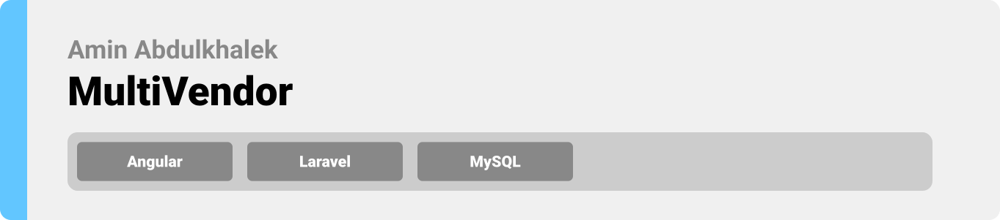

<div align="center">

> Hello world! This is the project’s summary that describes the project plain and simple, limited to the space available. 


**[PROJECT PHILOSOPHY](https://github.com/julescript/well_app#-project-philosophy) • [WIREFRAMES](https://github.com/julescript/well_app#-wireframes) • [TECH STACK](https://github.com/julescript/well_app#-tech-stack) • [IMPLEMENTATION](https://github.com/julescript/well_app#-impplementation) • [HOW TO RUN?](https://github.com/julescript/well_app#-how-to-run)**

</div>

<br><br>


> The Multivendor app is a market place where users can browse through different products and buy what they desire. The marketplace hosts many vendors/shops and it's managed by an Admin
> 

### Admin Stories
- As an admin, I want to access my dashbaord, so that I can see my market place orders,products,sales,featured vendor
- As an admin, I want to approve/disapprove products
- As an admin, I want to aprove/disapprove vendors
- As an admin, I want to see all the customers in my app
- As a admin, I want to aprove/disapprove vendors
- As a admin, I want to choose a commission for every vendor
- As a admin, I want to aprove/disapprove orders
- As a admin, I want to make transaction for different vendors
- As a admin, I want to show/hide products reviews

### Vendor Stories
- As a Vendor, I want to access my dashbaord, so that I can see my store's orders,products,sales
- As a Vendor, I want to add new products
- As a Vendor, I want to add update existing products
- As a Vendor, I want to add delete my products
- As a Vendor, I want to check my products status
- As a Vendor, I want to see my customers
- As a Vendor, I want to see my products reviews
- As a Vendor, I want to add update my profile

### Customer Stories
- As a user, I want to browsse products, 
- As a user, I want to browsse products with different categories
- As a user, I want to add product to my wishlist
- As a user, I want to remove product to my wishlist
- As a user, I want to add product to my cart
- As a user, I want to remove product to my wishlist
- As a user, I want to buy product 
- As a user, I want to add a review for a product 
- As a user, I want to flag a product or a vendor

<br><br>


> This design was planned before on paper, then moved to Figma app for the fine details.
Note that i didn't use any styling library or theme, all from scratch and using pure css modules

#### some of the frames:
 
 
 
 
 
 
 


<br><br>


Here's a brief high-level overview of the tech stack the Well app uses:

- This project uses the [Angular Frame Work](https://angular.io/). Angular is a TypeScript-based free and open-source web application framework led by the Angular Team at Google and by a community of individuals and corporations. Angular is a complete rewrite from the same team that built AngularJS.
- For persistent storage (database), the app uses [Laravel](https://laravel.com/) package which allows the app to create a custom storage schema and save it to a local database.


<br><br>


> Uing the above mentioned tecch stacks and the wireframes build with figma from the user sotries we have, the implementation of the app is shown as below, these are screenshots from the real app

#### some of the screenshots:
 
 
 
 
 
 
 


<br><br>


> This is an example of how you may give instructions on setting up your project locally.
To get a local copy up and running follow these simple example steps.

### Prerequisites
* Node.js

* composer
* Xampp php version 7.4 (once installed create a database called MultivendorDB)

* npm
```sh
npm install npm@latest -g
```

* Angular
```sh
npm install -g @angular/cli
```

* Laravel
```sh
composer global require laravel/installer
```

### Installation

1. Clone the repo
   ```sh
   git clone https://github.com/aminabdulkhalek/multivendor.git
   ```
2. Setup the Back-end:  
   ```sh
   cd MultiVendor/MultiVendor-BackEnd
   ```
   ```sh
   composer install
   ```
   ```sh
   cp .env.example .env
   ```
   Open your .env file and change the database name (DB_DATABASE) to MultivendorDB, username (DB_USERNAME) and password (DB_PASSWORD) field correspond to your configuration.
   
   ```sh
   php artisan key:generate
   ```
   ```sh
   php artisan migrate
   ```
   ```sh
   php artisan storage:link
   ```
   ```sh
   php artisan serve
   ```
3. Setup the Front-End
 ```sh
   cd MultiVendor/MultiVendor-FrontEnd
   ```
   ```sh
   npm i
   ```
   ```sh
   ng serve --open
   ```

